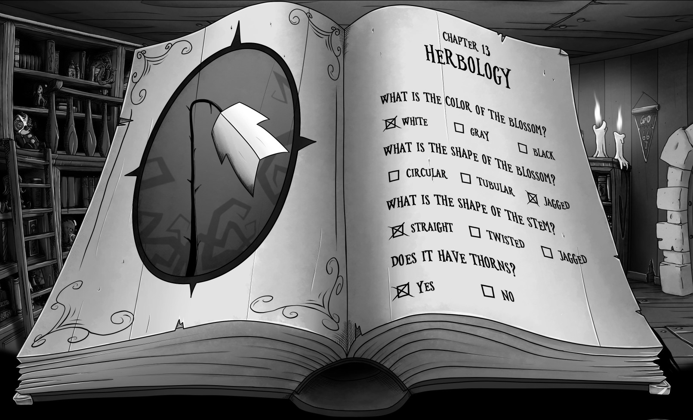
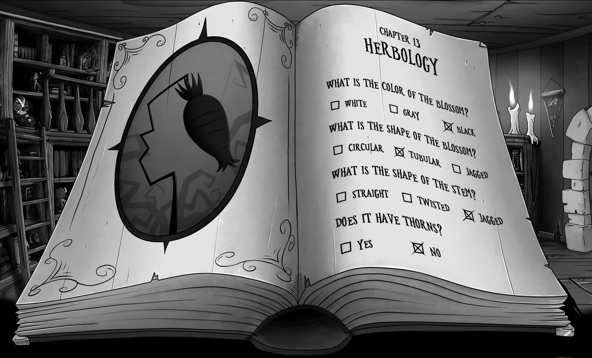

Spidereye caught some weird herbs from the bookshelf.

# What do they do?
You would need to identify them.

# How?
There's a Book of Herbology on the table. Grab that.

# And then?
You need to match the herb picture with the ones you have in your inventory by changing the features.

# Show me!
White Widow:

Acheron Swamp Trumpet:

White Widow is Hypno's Finest. It's hypnotic effect only affects if the subject is already very tired.
Acheron Swamp Trumpet. Amplifies subject's perception of music. Used as a party drug.